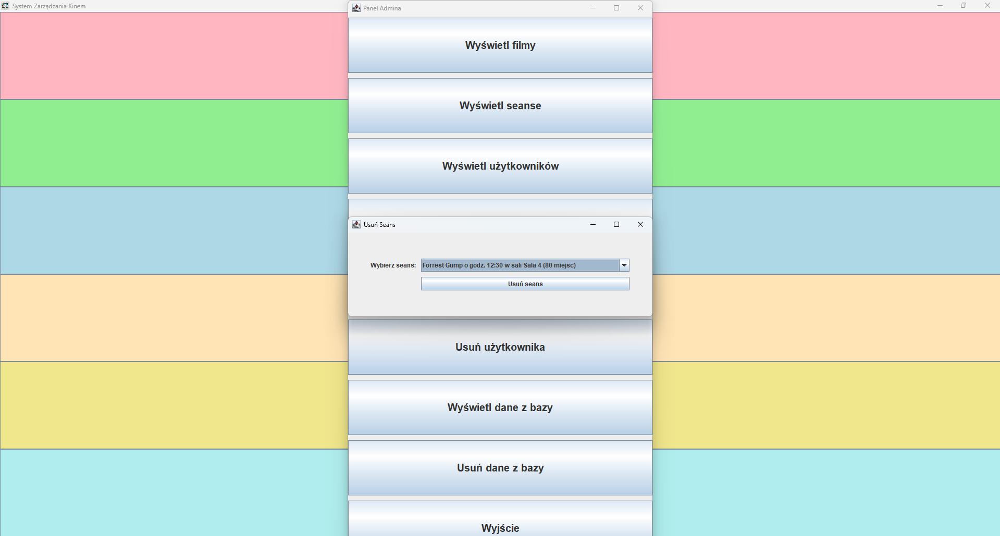
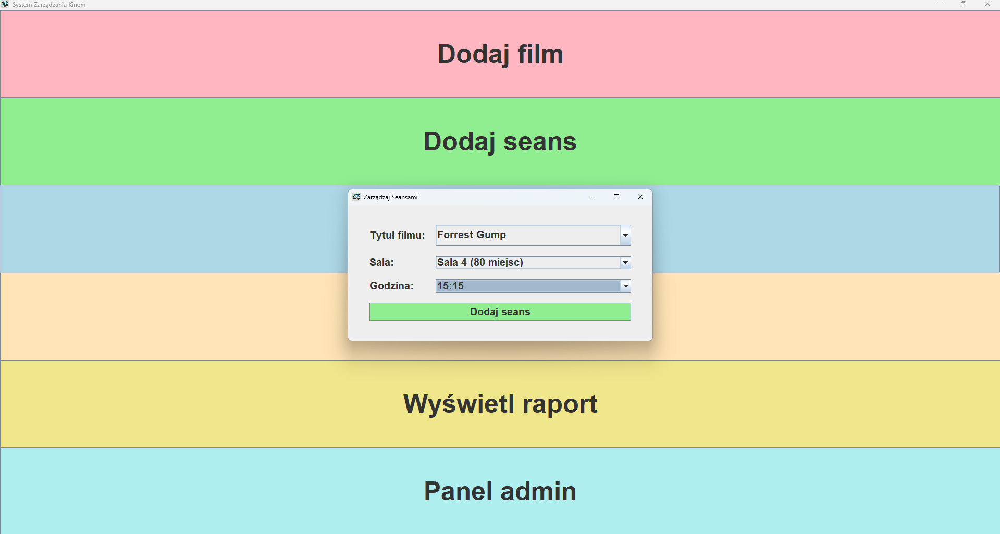
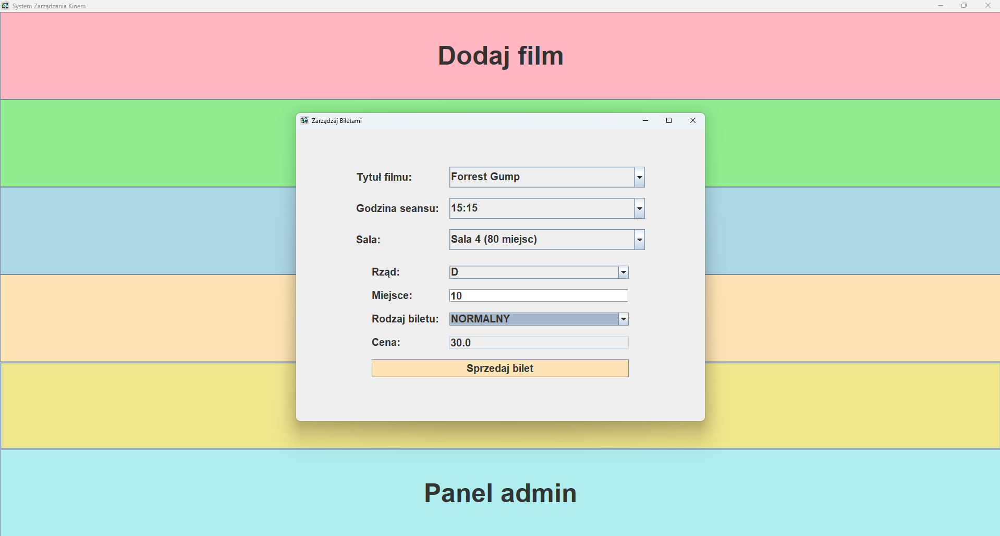

# Kino Zarządzanie Seansami

## Opis

Projekt ten jest aplikacją desktopową do zarządzania seansami kinowymi, pozwalającą na dodawanie, edytowanie i usuwanie seansów, a także zarządzanie biletami. Aplikacja jest napisana w języku Java z wykorzystaniem Swing do tworzenia interfejsu użytkownika oraz SQLite do przechowywania danych.

## Funkcje

- Dodawanie nowych seansów do bazy danych
- Edytowanie istniejących seansów
- Usuwanie seansów
- Zarządzanie biletami
- Przeglądanie listy seansów

## Struktura Projektu

Projekt składa się z kilku głównych modułów:

1. **AdminPanel**: Moduł odpowiedzialny za zarządzanie seansami przez administratora.
2. **Cinema**: Moduł reprezentujący kino.
3. **Screening**: Moduł reprezentujący seans filmowy.
4. **Film**: Moduł reprezentujący film.
5. **Hall**: Moduł reprezentujący salę kinową.
6. **Database**: Moduł odpowiedzialny za zarządzanie połączeniem z bazą danych SQLite.
7. **UI**: Moduł odpowiedzialny za interfejs użytkownika.

## Wymagania

- Java 23 lub nowsza
- SQLite JDBC Driver
- IDE wspierające projekty Java (np. IntelliJ IDEA, Eclipse)

## Instalacja

1. Pobierz i zainstaluj [Java Development Kit (JDK)](https://www.oracle.com/java/technologies/javase-jdk11-downloads.html).
2. Pobierz i zainstaluj [SQLite JDBC Driver](https://github.com/xerial/sqlite-jdbc).
3. Sklonuj repozytorium projektu:

    ```bash
    git clone https://github.com/Szymeq003/Cinema-Management-System
    ```
4. Otwórz projekt w swoim IDE.

## Użycie

1. Uruchom klasę `ScreeningManagerPanel` w swoim IDE.
2. Aby dodać nowy seans:
   - Wybierz tytuł filmu z rozwijanego menu.
   - Wybierz salę z rozwijanego menu.
   - Wybierz datę przy użyciu `JSpinner`.
   - Wybierz godzinę z rozwijanego menu.
   - Kliknij przycisk "Dodaj seans".
3. Aby przeglądać seanse, uruchom klasę `AdminScreeningManagementPanel`.
4. Aby usunąć seans, uruchom klasę `AdminDeleteScreeningPanel`.

## Autorzy

- [Szymon Pyrz](https://github.com/Szymeq003/)

## Licencja

Ten projekt jest licencjonowany na warunkach licencji MIT. Więcej informacji można znaleźć w pliku LICENSE.

## Zrzuty ekranu





## Uwagi

Jeśli masz jakiekolwiek pytania lub sugestie, prosimy o kontakt poprzez system issue na GitHubie lub bezpośrednio na [Twoj Email](szymon.pyrz03@gmail.com).
